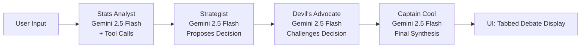

# 🏏 Captain Cool — Multi-Agent IPL Match Strategist

> **Built on Google Gemini 2.5 Flash** | APL 2025 Submission | Multi-Agent AI System

[](https://ai.google.dev/)
[](https://nextjs.org/)
[](https://www.typescriptlang.org/)

---

## 🎯 What Is This?

**Captain Cool** is an agentic AI system that acts as a **virtual IPL captain** — making the next tactical decision in a live match the way Dhoni, Rohit, or Hardik would.

Input the current match state → 4 specialized Gemini agents debate in real-time → Get the captain's optimal tactical call.

### 🚨 NEW: LIVE HYPE-MAN MODE
When the judges walk up to your table, switch to **Hype-Man Mode**! Feed it a live match event (e.g., "Dhoni hits a 100m six") and the app will instantly:
- Generate a massive neon screen alert
- Blast "Spicy Hinglish" meme commentary **OUT LOUD** using the Web Speech API
- Generate a prompt for Google Imagen 3 to visualize the hype
- Show the intensity level of the moment

---

## 🤖 The 4 Gemini Agents

```
📊 Stats Analyst → 🧠 Strategist → 😈 Devil's Advocate → 🏏 Captain Cool
```

| Agent | Role | Gemini Feature |
|-------|------|----------------|
| **📊 Stats Analyst** | Fetches win probability, pitch analysis, player profiles | Function calling / Tool use |
| **🧠 Strategist** | Reads analyst data, proposes the tactical decision | Multi-turn context, cricket system prompt |
| **😈 Devil's Advocate** | Challenges the Strategist, finds flaws | Adversarial reasoning prompt |
| **🏏 Captain Cool** | Synthesizes the debate, issues the FINAL CALL | Final synthesis with cricket commentary |

Each agent has:
- Its own **distinct system prompt** with a unique persona and role
- **Real Gemini 2.5 Flash** model calls (not a single Gemini call wearing 4 hats)
- Information flow: earlier agents' outputs are passed as context to later agents

---

## 🔧 Real Tool Use (Gemini Function Calling)

The **Stats Analyst** uses Gemini function calling with 3 tools:

1. **`get_win_probability`** — Calculates live win probability based on match state (innings, over, wickets, run rate, target)
2. **`get_pitch_analysis`** — Returns bowler type recommendations, batting approach based on venue + pitch conditions + dew
3. **`get_player_profile`** — Fetches player stats and recent form

The agent calls these tools autonomously, processes the results, and incorporates them into its analysis.

---

## 💬 Multi-Turn Reasoning Loop

```
1. Stats Analyst analyzes match → calls tools → produces statistical report
2. Strategist reads stats report → proposes a tactical decision
3. Devil's Advocate reads Strategist's decision → challenges it with specific cricket reasoning
4. Captain Cool reads the FULL DEBATE → either defends or revises → issues final call
```

The final output **always shows this back-and-forth** — all 4 agents' outputs are displayed in the UI.

---

## 📥 Inputs Supported

| Input | Options |
|-------|---------|
| Innings, Over, Ball | Full match state |
| Score, Wickets, RR | Real-time scoreboard |
| Batting/Bowling Teams | All 10 IPL teams |
| Striker / Non-striker | Named players |
| Venue | All 10 IPL stadiums |
| Pitch Type | Turning / Flat / Two-paced / Green-top |
| Dew Factor | None / Light / Heavy |
| Target & Required RR | 2nd innings chasing |
| Impact Player | Available or used |
| Bowler overs used | Per-bowler tracking |
| Strategic Timeout | Available or used |
| Additional context | Free-text match notes |

---

## 🚀 Getting Started

### Prerequisites
- Node.js 18+
- Google Gemini API key ([Get one here](https://aistudio.google.com/))

### Installation

```bash
cd captain-cool-app
npm install
```

### Configuration

Copy `.env.local` and add your key:

```bash
# .env.local
GEMINI_API_KEY=your_gemini_api_key_here
```

### Run

```bash
npm run dev
```

Open [http://localhost:3000](http://localhost:3000)

---

## 🏗️ Architecture

```
src/
├── app/
│   ├── api/
│   │   └── analyze/
│   │       └── route.ts          # 🧠 Core multi-agent orchestration
│   ├── globals.css               # Styling
│   ├── layout.tsx                # Root layout + SEO
│   └── page.tsx                  # Main page
├── components/
│   ├── HeroSection.tsx           # Animated hero
│   ├── MatchInputForm.tsx        # Match state input + 3 preset scenarios
│   └── AgentDebatePanel.tsx      # Tabbed debate display
└── types/
    └── index.ts                  # TypeScript types
```

### Agent Flow



---

## 📣 Sample Output

### Captain's Call Example (CSK chasing 197 at Wankhede, 16th over):

> **THE DECISION:** Send Dhoni in now. Bowl Bumrah's final over immediately — don't hold him.
>
> **Commentary:** "Yahan se match palta hai — this is the over that decides it. Heavy dew has killed Jadeja's spin, so you can't persist with him. The flat Wankhede surface rewards straight hitting, and with 39 off 21, only Dhoni has the temperament to finish this in calculated bursts. Bumrah in the 17th creates pressure; Dhoni targets the 19th for carnage."

---

## 🏆 Built For

**APL 2025** by GDG — Google's 3-hour vibe-coding hackathon

**Mandatory Tech Stack Used:**
- ✅ Gemini API — `gemini-2.5-flash` via `@google/genai`
- ✅ Gemini Function Calling — 3 real tool declarations
- ✅ Multi-agent architecture — 4 named, distinct agents with separate system prompts
- ✅ Multi-turn reasoning loop — Propose → Challenge → Synthesize
- ✅ Cricket-language output — Real commentator-style final decisions
- ✅ Google Antigravity — Built using Antigravity IDE

---

## 📝 License

MIT
